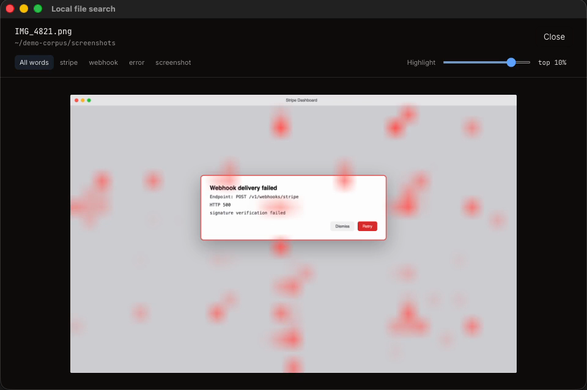
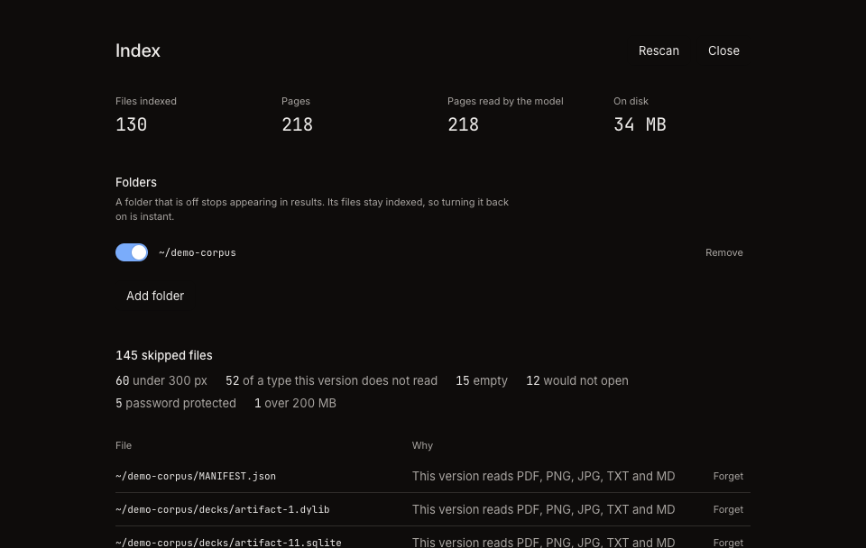

# Local file search

Find the screenshot of the error dialog, by describing the dialog.

A macOS app for Apple Silicon that indexes the files on your disk, retrieves pages by what they look like, shows you which part of the page matched, and answers questions with a citation you can click.

Built in seven days as a portfolio project.
The retrieval numbers below include the half it does not solve yet.

Retrieval runs on page images through [ColQwen2](https://huggingface.co/vidore/colqwen2-v1.0-merged), not on extracted text.
A chart with no caption, a screenshot of a dialog, a slide whose only words are its axis labels: those have almost no text to match and they are what this is for.

## What it does

Type, and results come back in about 40 ms from the text index while the vision model reranks them underneath.
Open a page and the overlay shows which patches answered your query, one query token at a time or combined.
Ask a question and the answer cites the pages it came from.



[Forty five seconds of it working](docs/demo.mp4): the query, the rerank, the page, and the overlay.

## Where your files go

The index, the page images and every embedding stay on this machine.

Two things reach the network.
The retrieval model downloads once from Hugging Face, 4.43 GB, on the first search or crawl that needs it.
It lands in the Hugging Face cache at `~/.cache/huggingface`, and deleting that directory is how you get the space back.
Asking a question sends the five matched page images to the provider you picked.

Searching, previewing a page and reading the heatmap need no account and no key at all.
Answering needs one, because every hosted provider authenticates even where it does not charge, and OpenRouter's free tier is no exception.

Everything else is local.
Once the model is on disk, indexing, search, the heatmap, the watcher and the file preview make no network call at all.
There is no analytics and no crash reporting. `tests/integration/test_shipped_bundle.py` fails if one is ever imported or even added as a dependency.

Run [Ollama](https://ollama.com) with `qwen2.5vl:7b` and pick it in settings, and the answer step stays on the machine too.
Nothing then leaves this Mac after the model download.

## Measured

M1 Max, 64 GB, macOS 26.5.1, torch 2.14.0, `vidore/colqwen2-v1.0-merged` in float16, 2026-09-09.
Every number here came from a run against `~/demo-corpus`, 275 files crawled into 130 indexed and 218 pages.

| | |
| --- | --- |
| Crawl and text index | 14.6 s, 18.8 files/s |
| Text search | 28 to 44 ms |
| Page embed | 1.19 s per page |
| Heatmap, cold | 1441 ms |
| Heatmap, cached | 44 ms |
| First answer token | 15.0 to 18.5 s on the free router |
| Index on disk | 21 MB for 218 pages, 12.3 MB of it vectors |
| Memory with the model loaded | 1.7 GB |
| A dropped file becomes searchable in | 2.1 s |

### Retrieval quality

30 golden queries, `scripts/eval.py` against a live sidecar, run `20260909T165833Z`.

| Split | Queries | hit@1 | hit@5 |
| --- | --- | --- | --- |
| Everything | 30 | 0.73 | 0.83 |
| Queries whose page carries matching words | 21 | 0.95 | 1.00 |
| Queries whose page carries none | 9 | 0.22 | 0.44 |

The second row is the product working. The third is the honest number, and it is the half this app exists for.

Both levers were measured and neither moved it.
Widening the vector candidate set from 30 to 250, which on this corpus means every page is a candidate, changes nothing.
Re-indexing at pooling factor 1 instead of 3, three times the vectors per page, changes nothing.

Looking at the pages says why.
Asked for "chart showing signups after the landing page redesign", the top result is page 3 of the right file, a paragraph reading "we shipped a redesigned landing page in week four and watched signups roughly double".
The expected page 2 is the chart itself.
MaxSim gives every query token its best-matching patch, and a page covered in text has a strong patch for every token, so text pages beat the picture of the thing.
Fixing that means changing how the two channels are fused, measured against the 21 out of 21 the text channel gets today.

## Install

Apple Silicon only.

Download the DMG from [releases](../../releases), drag the app across, then remove the quarantine flag:

```sh
xattr -dr com.apple.quarantine "/Applications/Local file search.app"
```

The app is not signed with an Apple Developer ID, so macOS refuses to open it until you do.

First launch downloads the model, which is 4.43 GB and happens once.

## Build it yourself

```sh
make setup     # both projects
make dev       # the app against a dev sidecar
make check     # lint, typecheck, unit tests, architecture contracts
make check-int # adapters against real dependencies
make slow      # the tests that load the real model
make build     # the sidecar bundle and the arm64 DMG
make corpus    # generate ~/demo-corpus to try it on
```

## How it is put together

Two processes. Electron owns the window and the filesystem dialogs; a Python sidecar owns the index and the model.
They speak HTTP over loopback on a port the OS assigns, authenticated with a bearer token generated per launch.

```text
Electron main ──spawn──> Python sidecar (waitress, 127.0.0.1:0)
      │                        │
   preload                  Flask routes
      │                        │
   renderer ────HTTP+SSE──────>│
                               ├── application: search, index, chat, eviction
                               ├── domain:      MaxSim, heatmap, citations, gate
                               └── infrastructure: ColQwen2, LanceDB, pdfium, Vision
```

Both sides are onion architecture, and the layer order is enforced rather than encouraged: `make check` runs three import-linter contracts on the Python and dependency-cruiser on the TypeScript, and a build fails when a dependency points outward.
The domain layer holds only the standard library and numpy, and the contract names every runtime dependency by hand so that `import torch` inside it is a failing build rather than a code review someone has to remember to do.

Search runs in two stages.
Stage 1 is BM25 over the text and filenames, which returns in milliseconds and is what you see while you type.
Stage 2 reranks those candidates by MaxSim over the page vectors, and merges in the pages the vector store finds directly, because a weak text match is not a missing one.

Pages are embedded lazily.
A 40,000 file disk gets a text index of all of it and vectors for the pages that searches actually reach, plus whatever idle time on AC power can get through in the background.

`docs/DECISIONS.md` records every locked decision with the reason.
`docs/STATUS.md` carries every measurement with the machine, model and date it came from.

### What is indexed, and what was left out

A result list can only be believed by someone who knows what is missing from it, so the index screen is half skipped files and the reason each one was skipped.



## License

MIT. See [LICENSE](LICENSE).
